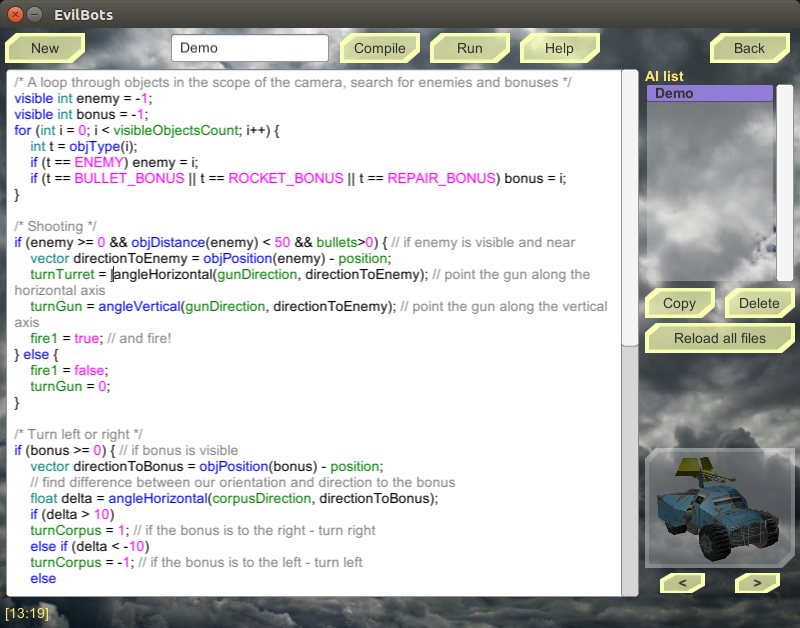
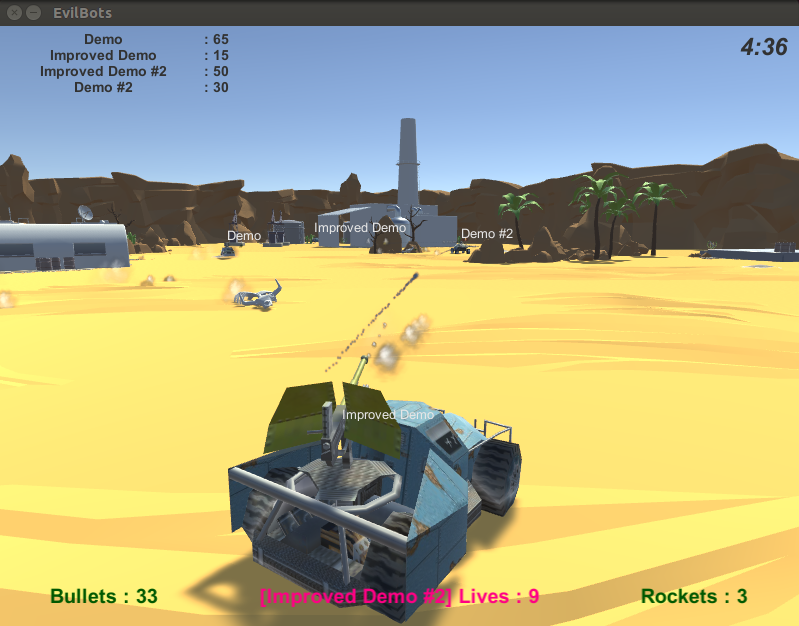
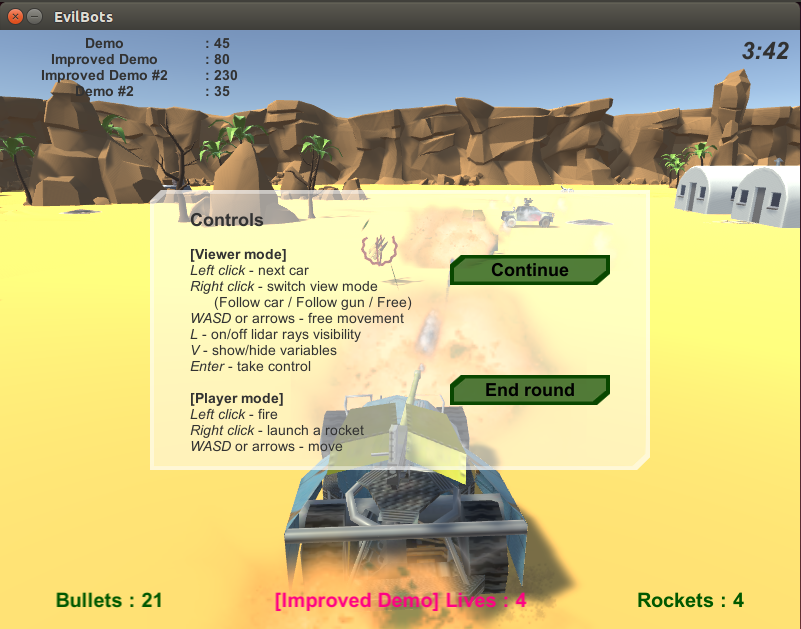

# EvilBots

It is a game for programmers. You are to develop an AI for a battle car and to watch your car fight other AIs. Of course, there is also a manual control mode, but it is not a main function.

The main idea and some game resources are borrowed from the [SmartBots](https://github.com/asfdfdfd/SmartBots/) project.

Binaries are available for Linux, Windows, and MacOS.

